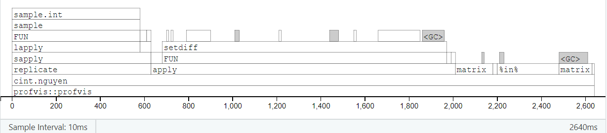
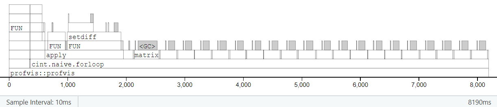

```{r, include = FALSE}
knitr::opts_chunk$set(
  collapse = TRUE,
  comment = "#>"
)
```

We run simple timing comparisons to show how our package's approach with Nguyen (2009) compares against a "naive" grid-based search approach to confidence intervals from permutation methods.

# Defining streamlined functions

We can use `CIPerm`'s `cint(dset(x, y))` directly,
and it already wins against the naive for-loop or array-based approaches.
But since `dset` and `cint` both have extra cruft built into them,
for an even "fairer" comparison we recreate the core of `cint(dset())` here
without all the extra variables and without passing copies of dataframes.

First we re-define the internal function `roundOrCeiling()`, then we define a streamlined `cint.nguyen()`:

```{r function-nguyen}
#### Define a streamlined function for Nguyen approach ####

# 1. use round(siglevel*num), if siglevel*num is basically an integer,
#    to within the default numerical tolerance of all.equal();
# 2. or otherwise use ceiling(siglevel*num) instead.
roundOrCeiling <- function(x) {
  ifelse(isTRUE(all.equal(round(x), x)), # is x==round(x) to numerical tolerance?
         round(x),
         ceiling(x))
}

cint.nguyen <- function(x, y, nmc = 10000, conf.level = 0.95) {
  # Two-tailed CIs only, for now

  sig <- 1 - conf.level

  # Code copied/modified from within CIPerm::dset()
  n <- length(x)
  m <- length(y)
  N <- n + m
  num <- choose(N, n) # number of possible combinations
  # Form a matrix where each column contains indices in new "group1" for that comb or perm
  if(nmc == 0 | num <= nmc) { # take all possible combinations
    dcombn1 <- utils::combn(1:N, n)
  } else { # use Monte Carlo sample of permutations, not all possible combinations
    dcombn1 <- replicate(nmc, sample(N, n))
    dcombn1[,1] <- 1:n # force the 1st "combination" to be original data order
    num <- nmc
  }
  # Form the equivalent matrix for indices in new "group2"
  dcombn2 <- apply(dcombn1, 2, function(x) setdiff(1:N, x))

  # Form the corresponding matrices of data values, not data indices
  combined <- c(x, y)
  group1_perm <- matrix(combined[dcombn1], nrow = n)
  group2_perm <- matrix(combined[dcombn2], nrow = m)
  # For each comb or perm, compute difference in group means, k, and w_{k,d}
  diffmean <- colMeans(group1_perm) - colMeans(group2_perm)
  k <- colSums(matrix(dcombn1 %in% ((n+1):N),
                      nrow = n))
  wkd <- (diffmean[1] - diffmean) / (k * (1/n + 1/m))

  # Code copied/modified from within CIPerm::cint()
  # Sort wkd values and find desired quantiles
  w.i <- sort(wkd, decreasing = FALSE, na.last = FALSE)
  siglevel <- (1 - conf.level)/2
  index <- roundOrCeiling(siglevel*num) - 1
  #   When dset's nmc leads us to use Monte Carlo sims,
  #   we may get some permutations equivalent to orig data
  #   i.e. we may get SEVERAL k=0 and therefore several w.i=NaN.
  nk0 <- sum(k == 0)
  # Start counting from (1+nk0)'th element of w.i
  # (not the 1st, which will always be 'NaN' since k[1] is 0)
  LB <- w.i[1 + nk0 + index]
  UB <- w.i[(num - index)]

  CI <- c(LB, UB)
  conf.achieved <- 1 - (2*(index+1) / num)
    message(paste0("Achieved conf. level: 1-2*(", index+1, "/", num, ")"))
    return(list(conf.int = CI,
                conf.level.achieved = conf.achieved))
}
```

Next, we define an equivalent function to implement the "naive" approach: 

* Choose a grid of possible values of delta = mu_X-mu_Y to try
* For each delta...
    - subtract delta off of the x's,
    - and carry out a test of H_0: mu_X=mu_Y on the resulting data
* Our confidence interval consists of the range of delta values for which H_0 is NOT rejected

```{r function-forloop}
#### Define a function for "naive" approach with for-loop ####

cint.naive.forloop <- function(x, y, deltas,
                               nmc = 10000,
                               conf.level = 0.95) {
  # Two-tailed CIs only, for now

  sig <- 1 - conf.level
  pvalmeans <- rep(1, length(deltas))

  # Code copied/modified from within CIPerm::dset()
  n <- length(x)
  m <- length(y)
  N <- n + m
  num <- choose(N, n) # number of possible combinations
  # Form a matrix where each column contains indices in new "group1" for that comb or perm
  if(nmc == 0 | num <= nmc) { # take all possible combinations
    dcombn1 <- utils::combn(1:N, n)
  } else { # use Monte Carlo sample of permutations, not all possible combinations
    dcombn1 <- replicate(nmc, sample(N, n))
    dcombn1[,1] <- 1:n # force the 1st "combination" to be original data order
    num <- nmc
  }
  # Form the equivalent matrix for indices in new "group2"
  dcombn2 <- apply(dcombn1, 2, function(x) setdiff(1:N, x))

  for(dd in 1:length(deltas)) {
    xtmp <- x - deltas[dd]

    # Code copied/modified from within CIPerm::dset()
    combined <- c(xtmp, y)
    # Form the corresponding matrices of data values, not data indices
    group1_perm <- matrix(combined[dcombn1], nrow = n)
    group2_perm <- matrix(combined[dcombn2], nrow = m)
    # For each comb or perm, compute difference in group means
    diffmean <- colMeans(group1_perm) - colMeans(group2_perm)

    # Code copied/modified from within CIPerm::pval()
    pvalmeans[dd] <- sum(abs(diffmean - mean(diffmean)) >= abs(diffmean[1] - mean(diffmean)))/length(diffmean)
  }
  print( range(deltas[which(pvalmeans >= sig)]) )
  return(list(cint = range(deltas[which(pvalmeans >= sig)]),
              pvalmeans = pvalmeans,
              deltas = deltas))
}
```

We also wrote another "naive" function that avoids for-loops and takes a "vectorized" approach instead. We created large arrays: each permutation requires a matrix, and the 3rd array dimension is over permutations. Then `apply` and `colSums` work very quickly to carry out all the per-permutations steps on this array at once. However, we found that unless datasets were trivially small, creating and storing the array took a lot of time and memory, and it ended up far slower than the for-loop approach. Consequently we do not report this function or its results here, although curious readers can find it hidden in the vignette's .Rmd file.

```{r function-array, echo=FALSE, eval=FALSE}
## THIS FUNCTION ALSO WORKS,
## BUT REQUIRES SUBSTANTIALLY MORE MEMORY THAN THE PREVIOUS ONE
## AND IS SLOWER FOR LARGE DATASETS,
## SO WE LEFT IT OUT OF THE COMPARISONS

# Possible speedup:
# Could we replace for-loop with something like manipulating a 3D array?
# e.g., where we say
###     group1_perm <- matrix(combined[dcombn1], nrow = n)
# could we first make `combined` into a 2D matrix
#   where each col is like it is now,
#   but each row is for a different value of delta;
# and then group1_perm would be a 3D array,
#   where each 1st+2nd dims matrix is like it is now,
#   but 3rd dim indexes over deltas;
# and then `diffmean` and `pvalmeans`
#   would be colMeans or similar over an array
#   so the output would be right

cint.naive.array <- function(x, y, deltas,
                             nmc = 10000,
                             conf.level = 0.95) {
  # Two-tailed CIs only, for now
  sig <- 1 - conf.level

  # New version where xtmp is a matrix, not a vector;
  # and some stuff below will be arrays, not matrices...
  xtmp <- matrix(x, nrow = length(x), ncol = length(deltas))
  xtmp <- xtmp - deltas[col(xtmp)]
  combined <- rbind(xtmp,
                    matrix(y, nrow = length(y), ncol = length(deltas)))

  # Code copied/modified from within CIPerm::dset()
  n <- length(x)
  m <- length(y)
  N <- n + m
  num <- choose(N, n) # number of possible combinations
  # Form a matrix where each column contains indices in new "group1" for that comb or perm
  if(nmc == 0 | num <= nmc) { # take all possible combinations
    dcombn1 <- utils::combn(1:N, n)
  } else { # use Monte Carlo sample of permutations, not all possible combinations
    dcombn1 <- replicate(nmc, sample(N, n))
    dcombn1[,1] <- 1:n # force the 1st "combination" to be original data order
    num <- nmc
  }
  # Form the equivalent matrix for indices in new "group2"
  dcombn2 <- apply(dcombn1, 2, function(x) setdiff(1:N, x))

  # ARRAYS of data indices, where 3rd dim indexes over deltas
  dcombn1_arr <- outer(dcombn1, N * (0:(length(deltas)-1)), FUN = "+")
  dcombn2_arr <- outer(dcombn2, N * (0:(length(deltas)-1)), FUN = "+")

  # Form the corresponding ARRAYS of data values, not data indices
  group1_perm <- array(combined[dcombn1_arr], dim = dim(dcombn1_arr))
  group2_perm <- array(combined[dcombn2_arr], dim = dim(dcombn2_arr))

  # For each comb or perm, compute difference in group means
  # diffmean <- matrix(colMeans(group1_perm, dim=1), nrow = num) -
  #   matrix(colMeans(group2_perm, dim=1), nrow = num)
  diffmean <- colMeans(group1_perm, dim=1) - colMeans(group2_perm, dim=1)

  # Code copied/modified from within CIPerm::pval()
  pvalmeans <- colSums(abs(diffmean - colMeans(diffmean)[col(diffmean)]) >= abs(diffmean[1,] - colMeans(diffmean))[col(diffmean)])/nrow(diffmean)
  # plot(deltas, pvalmeans)

  print( range(deltas[which(pvalmeans >= sig)]) )
  return(list(cint = range(deltas[which(pvalmeans >= sig)]),
              pvalmeans = pvalmeans,
              deltas = deltas))
}
```

# Speed tests

## Tiny dataset

When we compare the timings, `cint.naive()` will need to have a reasonable search grid for values of `delta`. On this problem, we happen to know the correct CI endpoints are the integers `(-21, 3)`, so we "cheat" by using `(-22):4` as the grid for `cint.naive()`. Of course in practice, if you had only the naive approach, you would probably have to try a wider grid, since you wouldn't already know the answer.

```{r tests-tiny}
#### Speed tests on Nguyen's tiny dataset ####

# Use 1st tiny dataset from Nguyen's paper
library(CIPerm)
x <- c(19, 22, 25, 26)
y <- c(23, 33, 40)

# Actual CIPerm package's approach:
system.time({
  print( cint(dset(x, y), conf.level = 0.95, tail = "Two") )
})

# Streamlined version of CIPerm approach:
system.time({
  print( cint.nguyen(x, y, conf.level = 0.95) )
})

# Naive approach with for-loops:
deltas <- ((-22):4)
system.time({
  pvalmeans <- cint.naive.forloop(x, y, deltas)$pvalmeans
})

# Sanity check to debug `cint.naive`:
# are the p-vals always higher when closer to middle of CI?
# Are they always above 0.05 inside and below it outside CI?
cbind(deltas, pvalmeans)
plot(deltas, pvalmeans)
abline(h = 0.05)
abline(v = c(-21, 3), lty = 2)
# Yes, it's as it should be :)
```

Above we see timings for the original `CIPerm::cint(dset))`, its streamlined version`cint.nguyen()`, and the naive equivalent `cint.naive()`.  
In the case of a tiny dataset like this, all 3 approaches take almost no time. So it can be a tossup as to which one is fastest on this example.


```{r test-tiny-array, echo=FALSE, eval=FALSE}
# Naive approach with arrays:
system.time({
  pvalmeans <- cint.naive.array(x, y, deltas)$pvalmeans
})

# Sanity check again:
cbind(deltas, pvalmeans)
plot(deltas, pvalmeans)
abline(h = 0.05)
abline(v = c(-21, 3), lty = 2)
# Yep, still same results. OK.
# So this "array" version IS faster,
# and nearly as fast as Nguyen
# (though harder to debug...
#  but the same could be said of Nguyen's approach...)

# WAIT WAIT WAIT
# I changed the for-loop approach to stop creating dcombn1 & dcombn2
# inside each step of the loop
# since we can reuse the same ones for every value of deltas...
# AND NOW it's FASTER than the array version,
# even for tiny datasets!
# And later we'll see that array version is unbearably slow
# for large datasets where it takes forever
# to create & store these massive arrays...
# So it's not worth reporting in the final vignette :(
```

## Larger dataset

Try a slightly larger dataset, where the total number of permutations is above the default `nmc=10000` but still manageable on a laptop.

Again, `cint.naive()` will need to have a reasonable search grid for values of `delta`. This time again we will set up a grid that just barely covers the correct endpoints from `cint.nguyen()`, and again we'll try to keep it at around 20 to 25 grid points in all. Then we'll try timing it again with a slightly finer grid.

```{r tests-larger}
choose(18, 9) ## 48620
set.seed(20220528)
x <- rnorm(9, mean = 0, sd = 1)
y <- rnorm(9, mean = 1, sd = 1)

# Actual CIPerm approach
# (with nmc = 0,
#  so that we use ALL of the choose(N,n) combinations
#  instead of a MC sample of permutations)
system.time({
  print( cint(dset(x, y, nmc = 0),
              conf.level = 0.95, tail = "Two") )
})

# Streamlined version of CIPerm approach:
system.time({
  print( cint.nguyen(x, y, nmc = 0, conf.level = 0.95) )
})

# Coarser grid
deltas <- ((-21):(1))/10     # grid steps of 0.1

# Naive with for-loops:
system.time({
  pvalmeans <- cint.naive.forloop(x, y, deltas, nmc = 0)$pvalmeans
})


# Finer grid
deltas <- ((-21*2):(1*2))/20 # grid steps of 0.05

# Naive with for-loops:
system.time({
  pvalmeans <- cint.naive.forloop(x, y, deltas, nmc = 0)$pvalmeans
})
```

Now, `CIPerm::cint(dset())` and the `cint.nguyen` approach take about the same amount of time, and they are noticeably faster than the `cint.naive` approach. (And even more so when we use a finer search grid.) That happens even with the "cheat" of using `CIPerm` first to find the right CI limits so that our naive search grid isn't too wide, just stepping over the minimal required range with a reasonable grid-coarseness.

(For the original data where CI = (-21, 3), we stepped from -22 to 4 in integers.
For latest data where CI = (-2.06, 0.08),
we stepped from -2.1 to 0.1 in units of 0.1 and then 0.05.)

In practice there are probably cleverer ways for the naive method to choose grid discreteness and endpoints...
but still, this seems like a more-than-fair chance for the naive approach.


```{r tests-larger-array, echo=FALSE, eval=FALSE}
# Coarser grid
deltas <- ((-21):(1))/10     # grid steps of 0.1

# Naive with arrays:
system.time({
  pvalmeans <- cint.naive.array(x, y, deltas, nmc = 1e6)$pvalmeans
})

# !!! Indeed it looks like naive.forloop
# is FASTER than naive.array
# now that I've removed the slow dcombn1 & dcombn2 creating from the loop.


# Finer grid
deltas <- ((-21*2):(1*2))/20 # grid steps of 0.05

# Naive with arrays:
system.time({
  pvalmeans <- cint.naive.array(x, y, deltas, nmc = 1e6)$pvalmeans
})
```


## Largest dataset

Try an even larger example,
where we're OK with a smallish total number of permutations (eg `nmc=10000`),
but the dataset itself is "huge",
so that each individual permutation takes a longer time.

We still don't make it all that large, since we want this vignette to knit in a reasonable time. But we've seen similar results when we made even-larger datasets that took longer to run.


Once again, for `cint.naive()` we will set up a search grid that just barely covers the correct endpoints from `cint.nguyen()`, and again we'll try to keep it at around 20 to 25 grid points in all.

```{r tests-largest}
#### Speed tests on much larger dataset ####

set.seed(20220528)
x <- rnorm(5e3, mean = 0, sd = 1)
y <- rnorm(5e3, mean = 1, sd = 1)

# Actual CIPerm approach
# (with nmc = 2000 << choose(N,n),
#  so it only takes a MC sample of permutations
#  instead of running all possible combinations)
system.time({
  print( cint(dset(x, y, nmc = 2e3),
              conf.level = 0.95, tail = "Two") )
})

# Streamlined version of CIPerm approach:
system.time({
  print( cint.nguyen(x, y, nmc = 2e3, conf.level = 0.95) )
})

# Grid of around 20ish steps
deltas <- ((-11*10):(-9*10))/100 # grid steps of 0.01

# Naive with for-loops:
system.time({
  pvalmeans <- cint.naive.forloop(x, y, deltas, nmc = 2e3)$pvalmeans
})
```

```{r tests-largest-array, echo=FALSE, eval=FALSE}
# Naive with arrays:
system.time({
  pvalmeans <- cint.naive.array(x, y, deltas, nmc = 2e3)$pvalmeans
})
```

Here we finally see that the overhead built into `CIPerm::cint(dset())` makes it slightly slower than the streamlined `cint.nguyen()`. However, both are *substantially* faster than `cint.naive()`---they run in less than half the time of the naive approach.


# `bench::mark()` and `profvis`

The results above are from one run per method on each example dataset.

Using the last ("largest") dataset, we also tried using `bench::mark()` to summarize the distribution of runtimes over many runs, as well as memory usage.  
*(Not actually run when the vignette knits, in order to avoid needing `bench` as a dependency.)*

```{r tests-largest-benchmark}
# bench::mark(cint.nguyen(x, y, nmc = 2e3),
#             cint.naive.forloop(x, y, deltas, nmc = 2e3),
#             check = FALSE, min_iterations = 10)
#> # A tibble: 2 × 13
#>   expression                                        min   median `itr/sec` mem_alloc `gc/sec` n_itr  n_gc total_time result memory                  time            gc               
#>   <bch:expr>                                   <bch:tm> <bch:tm>     <dbl> <bch:byt>    <dbl> <int> <dbl>   <bch:tm> <list> <list>                  <list>          <list>           
#> 1 cint.nguyen(x, y, nmc = 2000)                    2.5s    2.71s     0.364    1.58GB     2.92    10    80     27.44s <NULL> <Rprofmem [32,057 × 3]> <bench_tm [10]> <tibble [10 × 3]>
#> 2 cint.naive.forloop(x, y, deltas, nmc = 2000)    7.87s    8.07s     0.120     7.4GB     4.64    10   388      1.39m <NULL> <Rprofmem [32,256 × 3]> <bench_tm [10]> <tibble [10 × 3]>

```

Finally, we also tried using the `profvis` package to check what steps are taking the longest time.  
*(Again, not actually run when the vignette knits, in order to avoid needing `profvis` as a dependency; but screenshots are included below.)*

```{r tests-largest-profvis}
# profvis::profvis(cint.nguyen(x, y, nmc = 2e3))
# profvis::profvis(cint.naive.forloop(x, y, deltas, nmc = 2e3))
```

For Nguyen's method, the initial setup with `combn()` or `sample()` followed by `apply(setdiff())` takes about 80% of the time, and the per-permutation calculations only take about 20% of the time:  
`profvis::profvis(cint.nguyen(x, y, nmc = 2e3))`



For the naive method, the initial setup is identical, and each round of per-permutation calculations is slightly faster than in Nguyen's method... but because you have to repeat them many times (*unless you already know the CI endpoints, in which case you wouldn't need to run this at all!*), they can add up to substantially more total time than for Nguyen's method.  
`profvis::profvis(cint.naive.forloop(x, y, deltas, nmc = 2e3))`


